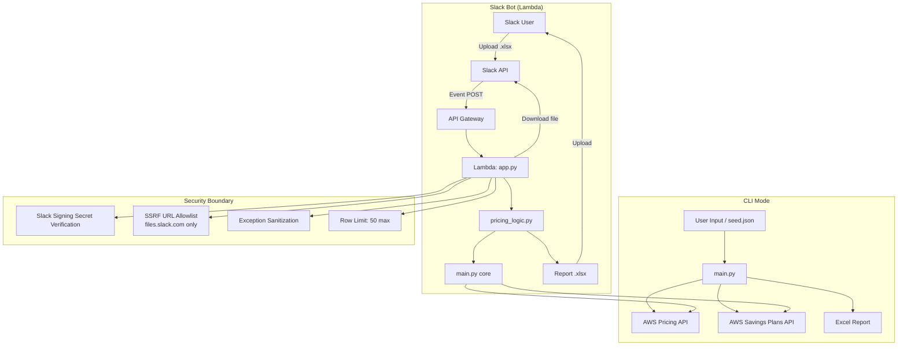

# AWS Cost Report Generator

[](https://python.org)
[](https://docs.aws.amazon.com/aws-cost-management/latest/APIReference/API_GetProducts.html)
[](LICENSE)
[](https://github.com/anomalyco/SLACK_AWS_Integration)
[](https://www.jenkins.io/)

Fetches EC2 and RDS pricing from the **AWS Pricing API** and **Savings Plans API**, then generates a formatted Excel report comparing On-Demand, Reserved Instance, and Compute Savings Plan costs.

---

## Features

| Feature                        | Description |
|-------------------------------|-------------|
| **EC2 Pricing**               | On-Demand, Compute SP 1/3yr, Standard RI 1/3yr |
| **RDS Pricing**               | On-Demand, Standard RI 1yr |
| **Multiple OS/Engines**       | Linux, Windows, RHEL, SUSE — MySQL, PostgreSQL, MariaDB, Oracle, SQL Server |
| **Region Support**            | 28 AWS regions |
| **CLI Mode**                  | Interactive prompts or seed-file-driven |
| **Slack Bot (Lambda)**        | Upload `.xlsx` to Slack, get report back in thread |
| **Threaded Lookups**          | 10 concurrent workers for fast API calls |
| **Auto-retry**                | Exponential backoff for throttled requests |
| **Formatted Excel Output**    | Styled sheets, currency format, N/A highlighting |
| **CI/CD**                     | Jenkins pipeline for automated Lambda deployment |

---

## Architecture



---

## Quick Start

<details open>
<summary><strong>Linux / macOS</strong></summary>

```bash
# One-click setup (detects & installs prerequisites)
chmod +x scripts/setup.sh
./scripts/setup.sh

# Or manually:
python3 -m venv .venv
source .venv/bin/activate
pip install -r requirements.txt
cp .env.example .env
# Edit .env with your credentials
python main.py
```

</details>

<details>
<summary><strong>Windows (PowerShell)</strong></summary>

```powershell
# One-click setup
Set-ExecutionPolicy -Scope Process -ExecutionPolicy Bypass
.\scripts\setup.ps1

# Or manually:
python -m venv .venv
.\.venv\Scripts\Activate.ps1
pip install -r requirements.txt
copy .env.example .env
# Edit .env with your credentials
python main.py
```

</details>

---

## Environment Variables

See [`.env.example`](.env.example) for the template.

| Variable | Required For | Description |
|---|---|---|
| `AWS_ACCESS_KEY_ID` | CLI | AWS access key (optional if using IAM role) |
| `AWS_SECRET_ACCESS_KEY` | CLI | AWS secret key (optional if using IAM role) |
| `AWS_SESSION_TOKEN` | CLI (optional) | Temporary STS credentials |
| `SLACK_BOT_TOKEN` | Slack Bot | Slack Bot token (`xoxb-...`) |
| `SLACK_SIGNING_SECRET` | Slack Bot | Slack App signing secret |

---

## CLI / API Reference

### `python main.py`

Run the pricing report generator in interactive mode.

```bash
python main.py
```

### `python main.py --seed <file.json>`

Run with predefined inputs from a JSON seed file.

**Seed file schema:**
```json
{
    "ec2": {
        "instance_types": ["t3.micro", "m5.large"],
        "regions": ["us-east-1", "eu-west-1"],
        "os_list": ["Linux", "Windows"]
    },
    "rds": {
        "rows": [
            {"instance_type": "db.t3.micro", "region": "us-east-1", "engine": "MySQL"}
        ]
    }
}
```

### Lambda Handler

| Attribute | Value |
|---|---|
| **Handler** | `app.lambda_handler` |
| **Runtime** | Python 3.10+ |
| **Timeout** | 5+ minutes |
| **Memory** | 512 MB |
| **Trigger** | API Gateway HTTP API, `POST /slack/events` |

---

## Supported Pricing Models

| Service | Model | Source API |
|---|---|---|
| EC2 | On-Demand | Pricing API |
| EC2 | Compute Savings Plan 1yr No Upfront | Savings Plans API |
| EC2 | Compute Savings Plan 3yr No Upfront | Savings Plans API |
| EC2 | Standard RI 1yr No Upfront | Pricing API |
| EC2 | Standard RI 3yr No Upfront | Pricing API |
| RDS | On-Demand | Pricing API |
| RDS | Standard RI 1yr No Upfront | Pricing API |

---

## Input File Format

Upload an `.xlsx` file (max 50 rows) with one or both sheets:

**Sheet: `EC2`**
| instance_type | region | os |
|---|---|---|
| t3.micro | us-east-1 | Linux |
| m5.large | eu-west-1 | Windows |

**Sheet: `RDS`**
| instance_type | region | engine |
|---|---|---|
| db.t3.micro | us-east-1 | MySQL |
| db.m5.large | eu-west-1 | PostgreSQL |

---

## IAM Policy

### CLI / Local
```json
{
    "Version": "2012-10-17",
    "Statement": [
        {
            "Effect": "Allow",
            "Action": [
                "pricing:GetProducts",
                "savingsplans:DescribeSavingsPlansOfferingRates"
            ],
            "Resource": "*"
        }
    ]
}
```

### Lambda Execution Role
```json
{
    "Version": "2012-10-17",
    "Statement": [
        {
            "Effect": "Allow",
            "Action": [
                "pricing:GetProducts",
                "savingsplans:DescribeSavingsPlansOfferingRates"
            ],
            "Resource": "*"
        },
        {
            "Effect": "Allow",
            "Action": [
                "logs:CreateLogGroup",
                "logs:CreateLogStream",
                "logs:PutLogEvents"
            ],
            "Resource": "*"
        }
    ]
}
```

---

## Security

The following mitigations are in place:

| Threat | Mitigation |
|---|---|
| **Hardcoded credentials** | `.env`, `.secret_key`, `seed.json` all gitignored. Template files (`.env.example`, `seed.json.example`) contain placeholders only. |
| **SSRF** | `file_url` is validated against an allowlist of Slack CDN domains (`files.slack.com`, `slack-files.com`). Requests are HTTPS-only. |
| **XSS in Slack messages** | Exception messages are sanitized — user data is never echoed back. Slack's `chat.postMessage` treats text as plaintext. |
| **CSRF** | Slack's Signing Secret verification (`slack_bolt` middleware) ensures all events originate from Slack. |
| **Command injection** | No `subprocess`, `os.system`, or `eval()` calls in the codebase. |
| **SQL injection** | No database used. |
| **Path traversal** | All file paths are hardcoded (`/tmp/input.xlsx`, `/tmp/completed_report.xlsx`). No user-supplied paths. |
| **Insecure deserialization** | No `pickle`, `yaml.load`, or `eval()` used. JSON loaded with `json.load()` (safe). |
| **Row limit** | Maximum 50 rows enforced to prevent Lambda timeout abuse. |
| **Stale artifacts** | `package/`, `__pycache__`, `.xlsx` reports, `session-*.md` are gitignored and cleaned regularly. |
| **Dependency CVEs** | See `requirements.txt` — all libraries are recent stable versions. Run `pip-audit` to check. |

**Credential rotation:** If you believe AWS credentials have been exposed, immediately:
1. Go to [IAM > Users > Security Credentials](https://console.aws.amazon.com/iamv2/home#/users)
2. Deactivate the old access key
3. Create a new access key
4. Update your `.env` file

---

## Jenkins CI/CD

The project includes a `Jenkinsfile` that automatically packages and deploys the Lambda function. The pipeline:
1. Installs Python dependencies (`slack_bolt`, `requests`, `openpyxl`)
2. Copies source files into a build directory
3. Creates a deployment zip
4. Calls `aws lambda update-function-code`

**Agent requirements:** An EC2 instance profile with `lambda:UpdateFunctionCode` permission.

---

## Project Structure

```
.
├── app.py                 # Slack bot Lambda handler (slack_bolt)
├── main.py                # Core pricing logic (Pricing / SP API calls)
├── pricing_logic.py       # Bridge: reads uploaded xlsx, calls main.py, writes report
├── requirements.txt       # Python dependencies
├── Jenkinsfile            # CI/CD pipeline for Lambda deployment
├── seed.json.example      # Example seed file for --seed flag
├── .env.example           # Template for environment variables
├── .gitignore
├── scripts/
│   ├── setup.sh           # Linux/macOS one-click setup
│   └── setup.ps1          # Windows PowerShell one-click setup
└── README.md
```

---

## Contributing

1. Fork the repository
2. Create a feature branch (`git checkout -b feat/amazing-feature`)
3. Commit your changes (`git commit -m 'Add amazing feature'`)
4. Run `python -m pytest` (add tests for new functionality)
5. Push to your branch (`git push origin feat/amazing-feature`)
6. Open a Pull Request

### Guidelines
- Write Python 3.10+ type-annotated code
- Keep functions pure and testable
- Do not commit secrets or real credentials
- Update documentation for any API changes

---

## License

MIT
